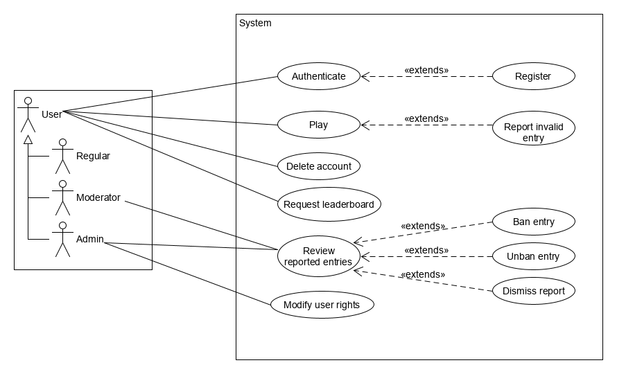

# open-live-trivia-api
**Open Live Trivia** is an open-source multiplayer trivia game. This repo hosts the server-side part of the project. For the corresponding client app, please check [this](https://github.com/radusalagean/open-live-trivia-app-android) link.

## Required files
```
~/.open-live-trivia_vault/open-live-trivia-firebase-adminsdk-e5krk-044318ee08.json
secrets/db_root_password.txt
```

## Overview
### Game rules
- An entry is displayed every round
- Every player has 3 free attempts available to submit the correct answer
- Additional attempts will cost 1 point
- The answers are case insensitive
- Every 5 seconds, a new random character is revealed from the answer (defined as a split)
- Entries range from 10 to 100 points in value (based on their difficulty)
- Their value decreases as more characters are revealed
- The first player to submit the correct answer wins the prize and the round is over

### Other features
- Users are able to request the game leaderboard
- There are 3 right levels that a user can have:
  - *Regular* - type `0`
  - *Moderator* - type `1`
  - *Admin* - type `2`
- Users are able to report entries which they consider invalid / inappropriate while playing. Those can be reviewed later and then banned / dismissed by *moderators* or the *admin*.
- The *admin* is the only one able to grant or revoke extra rights to users
- All registered users are able to delete their accounts permanently



## Under the hood
### Authentication
Player authentication is achieved through [Firebase Auth](https://firebase.google.com/docs/auth/). The client app will send a token to the server that is valid for **one hour**. That token is automatically refreshed by the client app when needed, so tokens sent to the server should always be up to date. Upon receiving an authorized request from the client app, the server sends that token through [Firebase Admin](https://www.npmjs.com/package/firebase-admin) in order to receive a decrypted payload that contains necessary info such as `uid` (an unique id associated with the Google Account used to authenticate) and the `exp` field (the expiration date of the currently used token). The following activity diagram showcases the authentication flow:


[View the full resolution version](https://raw.githubusercontent.com/radusalagean/open-live-trivia-api/master/diagrams/authentication-activity.png)

### Game
The communication of game-specific events between the server and the client is based on [socket.io](https://socket.io). This approach facilitates real-time bidirectional communication between the two systems, which is ideal for the purpose of an online multiplayer game. The following activity diagram showcases the flow of game-specific events between the client and the server, based on the rules mentioned above:


[View the full resolution version](https://raw.githubusercontent.com/radusalagean/open-live-trivia-api/master/diagrams/game-activity.png)

## Usage
Base URL: `https://openlivetrivia.com/api/v1/`

For requests marked as `🔒`, you need to have the `Authorization` header set with your Firebase `idToken`.

For requests marked as `🗐`, the results will be paginated and pagination-specific query string can be passed to specify the `page` number. Example: `https://openlivetrivia.com/api/v1/user/leaderboard?page=2`.

For all POST / PUT requests that have a json body provided, you need to set the `application/json` value for the `Content-Type` header.

In the documentation, certain attributes displayed with a colon in the beginning (e.g. `:id`) need to be replaced with a corresponding value when you are making the call.

**Profile image access url:**
`https://openlivetrivia.com/public/user-thumbnails/:filename`, where:
- `filename` = `userId` + `.png`

Example: `https://openlivetrivia.com/public/user-thumbnails/5d1f77e3adc09e1fe5a9aa9e.png`

## Socket-based events `🔌`
**Access url:** `https://openlivetrivia.com/api/socket.io`
### Client `📣` -> `🎧` Server events
| **Event**| **Description**|
|----------|----------------|
| `authentication`|The first event sent by the client after socket connection. Pass the Firebase idToken in order to authenticate.|
| `ATTEMPT`|An attempt to submit the correct answer for the ongoing round|
| `REACTION`|An emoji that will broadcast to all the current players|
| `REPORT_ENTRY`|Report the ongoing entry of this round for further review by moderators or admin|
| `REQUEST_PLAYER_LIST`|Request the list of currently playing users|

**Note:** Events written in *CAPS* are game-specific events.

- Example bodies:
  - `authentication`:
  ```json
  {
    "idToken": "YOUR_ID_TOKEN"
  }
  ```
  - `ATTEMPT`:
  ```json
  {
    "message": "Funcrusher Plus"
  }
  ```
  - `REACTION`
  ```json
  {
    "emoji": "😇"
  }
  ```
  **Note:** The events not listed in the examples above don't require request bodies.
  
### Server `📣` -> `🎧` Client events
  |**Event**| **Description**|
  |---------|----------------|
  |`authenticated`|Sent to the client which authenticated successfully|
  |`unauthorized`|Sent to the client which failed to authenticate|
  |`WELCOME`|The first event sent by the server when a client is connected and authenticated|
  |`PEER_JOIN`|Broadcasted to all connected clients when a new client is connected and successfully authenticated|
  |`PEER_ATTEMPT`|Broadcasted to all connected clients when a client sent an attempt to the server|
  |`INSUFFICIENT_FUNDS`|Sent to the client who previously sent an attempt that he was unable to pay for|
  |`COIN_DIFF`|Sent to the client who previously sent an attempt if there was a change in his coin bank (like the price paid for the attempt and / or the reward received for the correct answer)|
  |`PEER_REACTION`|Broadcasted to all connected clients when a client sent a reaction to the server|
  |`ROUND`|Broadcasted to all connected clients when a new round starts|
  |`SPLIT`|Broadcasted to all connected clients when a new split starts|
  |`REVEAL`|Broadcasted to all connected clients when the last split finishes and no one submitted the right answer|
  |`ENTRY_REPORTED_OK`|Sent to the client who previously reported an entry, if the entry report was saved successfully|
  |`ENTRY_REPORTED_ERROR`|Sent to the client who previously reported an entry, if the entry report failed to save|
  |`PLAYER_LIST`|Sent to the client who previously requested a list of all the current players|
  |`PEER_LEFT`|Broadcasted to all connected clients when a client left the game session|
  
  - Examples bodies:
    - `unauthorized`:
    ```json
    {
      "message": "User id not found for the specified token, you need to register first"
    }
    ```
    - `WELCOME`
    ```json
    {
      "gameState": 1,
      "userCoins": 100,
      "entryId": 121885,
      "category": "we governed that state",
      "clue": "Pat Brown,Pete Wilson",
      "answer": "C____o___a",
      "currentValue": 14,
      "elapsedSplitSeconds": 7,
      "totalSplitSeconds": 15,
      "freeAttemptsLeft": 2,
      "entryReported": false,
      "players": 1,
      "attempts": [
        {
          "userId": "5d1f2052a93b8d38b87750d3",
          "username": "Radu",
          "message": "test attempt",
          "correct": false
        }
      ]
    }
    ```
    - `PEER_JOIN`
    ```json
    {
      "userId": "5d1f2052a93b8d38b87750d3",
      "username": "Radu"
    }
    ```
    - `PEER_ATTEMPT`
    ```json
    {
      "userId": "5d1f2052a93b8d38b87750d3",
      "username": "Radu",
      "message": "test attempt",
      "correct": false
    }
    ```
    - `COIN_DIFF`
    ```json
    {
      "coinDiff": 6
    }
    ```
    - `PEER_REACTION`
    ```json
    {
      "userId": "5d1f2052a93b8d38b87750d3",
      "username": "Radu",
      "emoji": "👾"
    }
    ```
    - `ROUND`
    ```json
    {
      "entryId": 121885,
      "category": "we governed that state",
      "clue": "Pat Brown,Pete Wilson",
      "answer": "__________",
      "currentValue": 20
    }
    ```
    - `SPLIT`
    ```json
    {
      "answer": "C_li_ornia",
      "currentValue": 4
    }
    ```
    - `REVEAL`
    ```json
    {
      "answer": "California"
    }
    ```
    - `PLAYER_LIST`
    ```json
    {
      "players": [
        {
          "_id": "5d1f2052a93b8d38b87750d3",
          "username": "Radu",
          "rights": 0,
          "coins": 106,
          "joined": "2019-07-05T10:41:44.203Z"
        }
      ]
    }
    ```
    - `PEER_LEFT`
    ```json
    {
      "userId": "5d1f2052a93b8d38b87750d3",
      "username": "Radu" 
    }
    ```
    
## Users `👤`
### Register `🔒`
**[<code>POST</code> user/register](https://openlivetrivia.com/api/v1/user/register)**

Request Body Parameters:
- `username` - *String* (required)

Example Request Body:
```json
{
  "username": "Radu"
}
```
Example Response Body **`201 CREATED`**:
```json
{
  "_id": "5d1f2052a93b8d38b87750d3",
  "username": "Radu",
  "rights": 0,
  "coins": 100,
  "joined": "2019-07-05T10:41:44.203Z"
}
```

Specific restrictions:
- Max username length: 50 characters
- Usernames must be unique (otherwise, `409 CONFLICT` will be returned)
- Usernames are considered unique on a case insensitive basis (e.g. if `Radu` is registered, trying to register `radu` will result in a conflict error)
- Note: spaces are allowed in usernames

### Login `🔒`
**[<code>POST</code> user/login](https://openlivetrivia.com/api/v1/user/login)**

Example Response Body **`200 OK`**:
```json
{
  "_id": "5d1f2052a93b8d38b87750d3",
  "username": "Radu",
  "rights": 0,
  "coins": 100,
  "joined": "2019-07-05T10:41:44.203Z"
}
```

### Delete user `🔒`
**[<code>DELETE</code> user/delete](https://openlivetrivia.com/api/v1/user/delete)**

Example Response Body **`200 OK`**:
```json
{
  "message": "Account removed successfully"
}
```
Specific restrictions:
- Admins are not allowed to remove their accounts

### Username availability
**[<code>GET</code> user/availability/:username](https://openlivetrivia.com/api/v1/user/availability/radu)**

Request URL parameters:
- `username` - candidate username (required)

Response codes: 
- **`200 OK`** - Username is available for registration
- **`409 CONFLICT`** - Username is unavailable for registration

### Update user rights `🔒 ADMIN`
**[<code>PUT</code> user/rights/:user_id/:rights_level](https://openlivetrivia.com/api/v1//user/rights/5d18a18aa12e471d24085d2e/1)**

Request URL parameters:
- `user_id` - the id of the target user (required)
- `rights_level` - one of the following values: (required)
  - `0` - *Regular*
  - `1` - *Moderator*
  - `2` - *Admin*
  
Example Response Body **`200 OK`**:
```json
{
  "message": "Chad's rights changed to type 1"
}
```

### Leaderboard `🔒` `🗐`
**[<code>GET</code> user/leaderboard](https://openlivetrivia.com/api/v1/user/leaderboard)**

Example Response Body **`200 OK`**:
```json
{
  "page": 1,
  "pages": 1,
  "itemsCount": 1,
  "perPage": 20,
  "items": [
    {
      "_id": "5d1f2968a93b8d38b87750d4",
      "rights": 2,
      "coins": 100,
      "lastSeen": "2019-07-05T10:41:44.203Z",
      "joined": "2019-07-05T10:41:44.203Z",
      "username": "Radu",
      "playing": true
    }
  ]
}
```

### Me `🔒`
**[<code>GET</code> user/me](https://openlivetrivia.com/api/v1/user/me)**

Example Response Body **`200 OK`**:
```json
{
  "_id": "5d1f2052a93b8d38b87750d3",
  "username": "Radu",
  "rights": 0,
  "coins": 100,
  "joined": "2019-07-05T10:41:44.203Z"
}
```

## Entry reports `🚩`
### Query reports `🔒 MODERATOR / ADMIN` `🗐`
**[<code>GET</code> reported_entry/get_reports](https://openlivetrivia.com/api/v1/reported_entry/get_reports)**

Request URL query string parameters:
- `banned` - *Boolean* (optional)

Example Response Body **`200 OK`**:
```json
{
  "page": 1,
  "pages": 1,
  "itemsCount": 1,
  "perPage": 10,
  "items": [
    {
      "reporters": [
        {
          "_id": "5d1f2968a93b8d38b87750d4",
          "username": "Radu"
        }
      ],
      "banned": false,
      "_id": "5d1f379a78c6e7342c49488e",
      "lastReported": "2019-07-05T11:42:18.216Z",
      "entryId": 34770,
      "category": "life science",
      "clue": "The monera kingdom consists of bacteria & the blue-green species of this",
      "answer": "Algae"
    }
  ]
}
```

Note: Entries currently running in the game will be excluded from the results.

### Ban reported entry `🔒 MODERATOR / ADMIN`
**[<code>PUT</code> reported_entry/ban/:report_id](https://openlivetrivia.com/api/v1/reported_entry/ban/5d1f379a78c6e7342c49488e)**

Request URL parameters:
- `report_id` - the id of the target report (required)

Example Response Body **`200 OK`**:
```json
{
  "message": "The entry has been banned successfully"
}
```

### Unban reported entry `🔒 MODERATOR / ADMIN`
**[<code>PUT</code> reported_entry/unban/:report_id](https://openlivetrivia.com/api/v1/reported_entry/unban/5d1f379a78c6e7342c49488e)**

Request URL parameters:
- `report_id` - the id of the target report (required)

Example Response Body **`200 OK`**:
```json
{
  "message": "The entry has been unbanned successfully"
}
```

### Dismiss reported entry `🔒 MODERATOR / ADMIN`
**[<code>PUT</code> reported_entry/dismiss/:report_id](https://openlivetrivia.com/api/v1/reported_entry/dismiss/5d1f379a78c6e7342c49488e)**

Request URL parameters:
- `report_id` - the id of the target report (required)

Example Response Body **`200 OK`**:
```json
{
  "message": "Entry report dismissed successfully"
}
```

## System `⚙️`
### Disconnect everyone `🔒 ADMIN`
**[<code>POST</code> system/disconnect_everyone](https://openlivetrivia.com/api/v1/system/disconnect_everyone)**

Example Response Body **`200 OK`**:
```json
{
  "message": "Sent the disconnect signal to 10 clients"
}
```

### Info
**[<code>GET</code> system/info](https://openlivetrivia.com/api/v1/system/info)**

Example Response Body **`200 OK`**:
```json
{
  "serverVersion": "1.0.0",
  "minAppVersionCode": 1,
  "latestAppVersionCode": 1,
  "isTriviaServiceRunning": true
}
```

## License

Apache License 2.0, see the [LICENSE](LICENSE) file for details.
